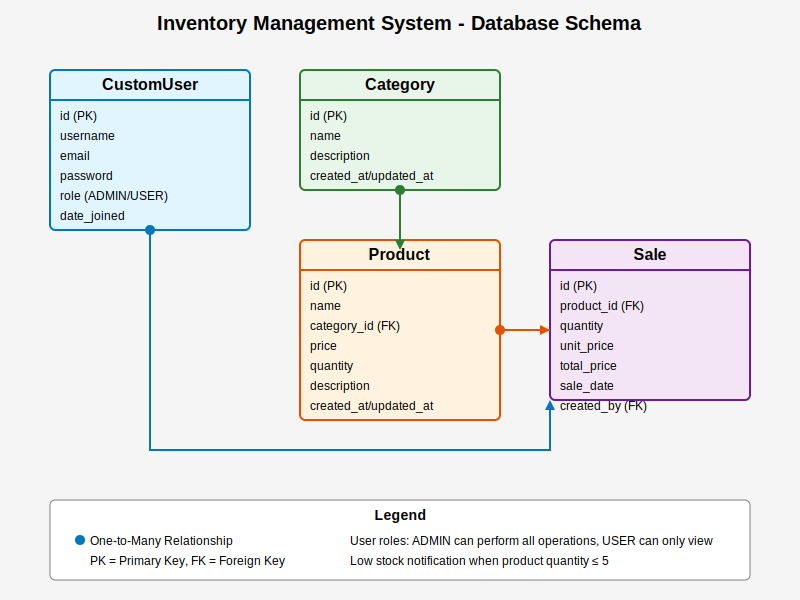

# Learn Django WITH FULL EXPLANATION
# Inventory Management System BACKEND

A Django REST Framework backend for an Inventory Management System that allows users to manage products, categories, stock levels, and sales.

## Features

- User Authentication (JWT)
  - Registration and Login
  - Role-based access control (Admin and User roles)
- Inventory Management
  - Add, view, update, and delete products
  - Track stock levels with low stock notifications
- Category Management
  - Organize products by categories
- Sales Management
  - Record sales and automatically update inventory

## Prerequisites

- Python 3.8+
- pip (Python package manager)

## Installation

1. **Clone the repository**

   ```bash
   git clone <repository-url>
   cd inventory-management
   ```

2. **Create and activate a virtual environment**

   ```bash
   python -m venv venv
   
   # On Windows
   venv\Scripts\activate
   
   # On macOS/Linux
   source venv/bin/activate
   ```

3. **Install dependencies**

   ```bash
   pip install -r requirements.txt
   ```

4. **Setup environment variables**

   Copy the `.env.example` file to `.env` and update the values:

   ```bash
   cp .env.example .env
   ```

5. **Run migrations**

   ```bash
   python manage.py migrate
   ```

6. **Create a superuser**

   ```bash
   python manage.py createsuperuser
   ```

7. **Run the development server**

   ```bash
   python manage.py runserver
   ```

   The API will be available at `http://localhost:8000/api/`


## Database Diagram




## API Endpoints

### Authentication

- `POST /api/users/register/` - Register a new user
- `POST /api/users/token/` - Obtain JWT token
- `POST /api/users/token/refresh/` - Refresh JWT token
- `GET /api/users/me/` - Get current user details

### Categories

- `GET /api/categories/` - List all categories
- `POST /api/categories/` - Create a new category (Admin only)
- `GET /api/categories/{id}/` - Retrieve a specific category
- `PUT /api/categories/{id}/` - Update a category (Admin only)
- `DELETE /api/categories/{id}/` - Delete a category (Admin only)

### Products

- `GET /api/products/` - List all products
- `POST /api/products/` - Create a new product (Admin only)
- `GET /api/products/{id}/` - Retrieve a specific product
- `PUT /api/products/{id}/` - Update a product (Admin only)
- `DELETE /api/products/{id}/` - Delete a product (Admin only)
- `GET /api/products/low_stock/` - List products with low stock
- `POST /api/products/{id}/update_stock/` - Update product stock (Admin only)

### Sales

- `GET /api/sales/` - List all sales (Admin only)
- `POST /api/sales/` - Create a new sale (Admin only)
- `GET /api/sales/{id}/` - Retrieve a specific sale (Admin only)
- `PUT /api/sales/{id}/` - Update a sale (Admin only)
- `DELETE /api/sales/{id}/` - Delete a sale (Admin only)

## Testing

Run the tests using:

```bash
python manage.py test
```


## Tech Stack

- **Django** - Web framework
- **Django REST Framework** - API toolkit
- **Simple JWT** - JWT authentication
- **PostgreSQL/SQLite** - Database
- **Pillow** - Image processing library

## Project Structure

The project consists of two main apps:

1. **api** - Core functionality (products, categories, sales)
2. **users** - User authentication and management

## Development Approach

1. **Authentication** - Implemented JWT-based authentication with custom user model
2. **Permissions** - Role-based permissions (Admin vs. Regular users)
3. **API Design** - RESTful API design with proper status codes and validation
4. **Testing** - Comprehensive test coverage for all API endpoints

